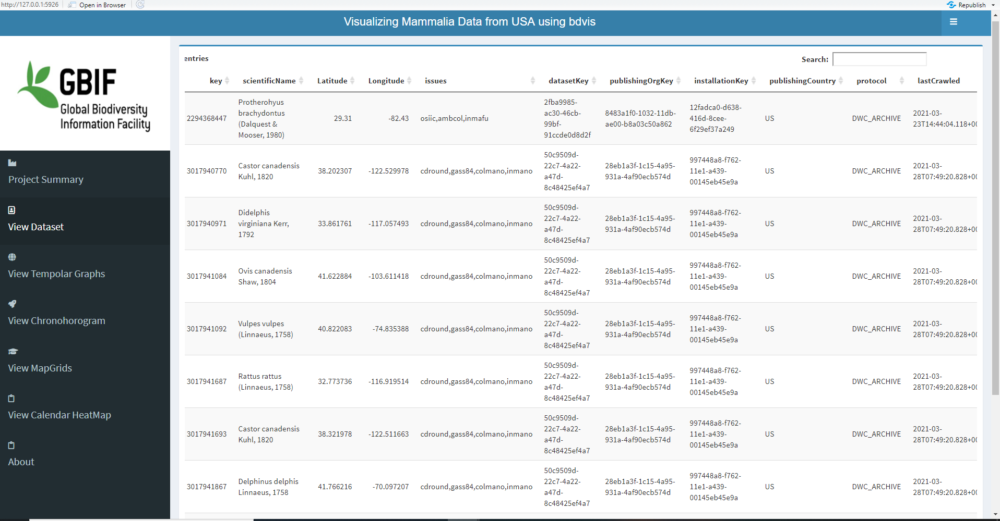
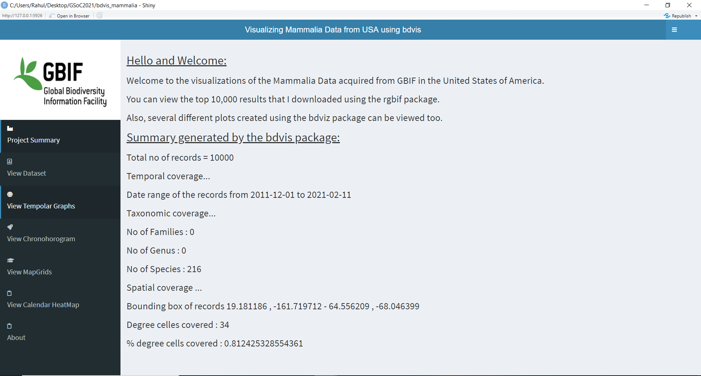
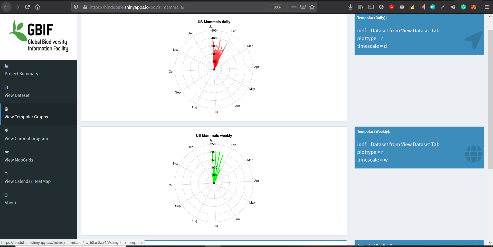
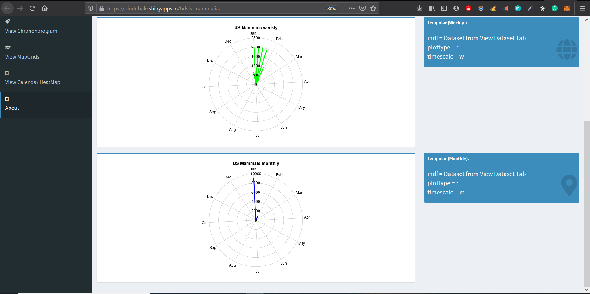
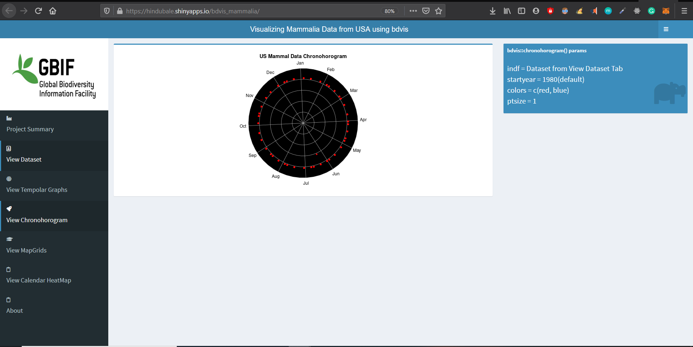
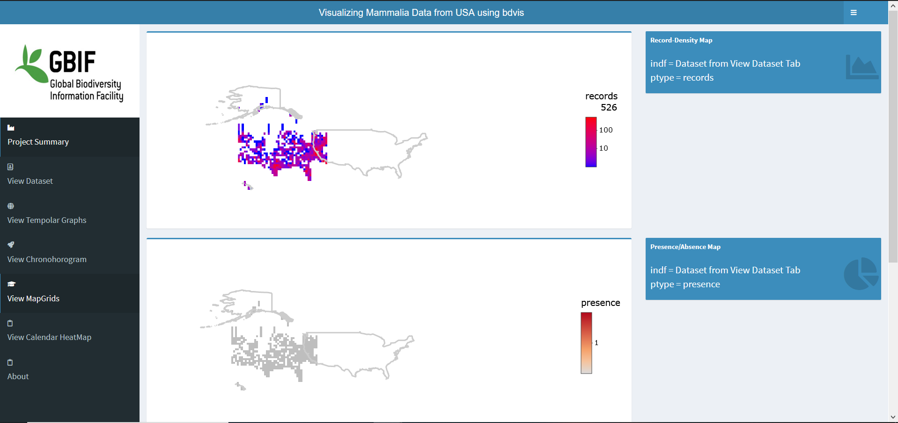
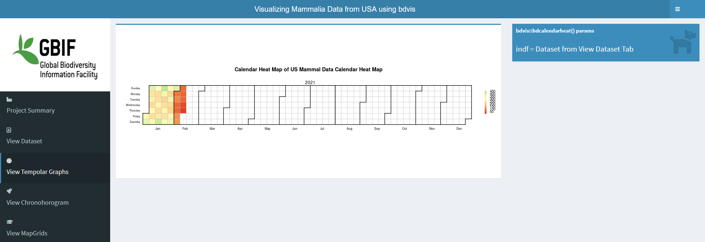

# Tests for Productionizing `bddashbaord`

## Easy Test :

#### Easy Task 1:
*Download 10,000 GBIF’s occurrence records of Mammals in the U.S (georeferenced records only), using the ‘rgbif’ R package.*

Check out the R Script for my Easy Test 1 [here](https://github.com/hinduBale/productionizing_bddashboard_test/blob/master/Easy%20Test%201/EasyTest1.R) and the required dataset can be found [here](https://github.com/hinduBale/productionizing_bddashboard_test/blob/master/Easy%20Test%201/mammal_data.csv). 

The above is easy to view and query hosted dataset at https://hindubale.shinyapps.io/bdvis_mammalia/

#### Easy Task 2:
*Create a simple shiny dashboard. Add some plot with ‘bdvis’ that most effectively summarizes the Mammals data you downloaded.*

Check out the code for the R Shiny app that I wrote to summarise the previously downloaded dataset using `bdvis` plots [here](https://github.com/hinduBale/productionizing_bddashboard_test/tree/master/Easy%20Test%202/bdvis_mammalia)

**Since, the app was completely built, I also hosted it, and it can be viewed at:** https://hindubale.shinyapps.io/bdvis_mammalia/

#### Here are some screenshots from the hosted Shiny App:

## Medium Task:

### Ongoing!!
